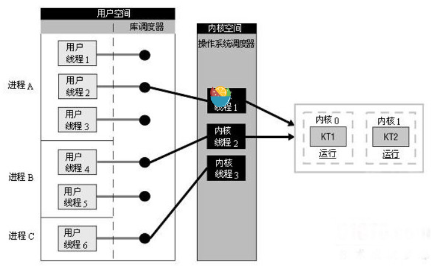
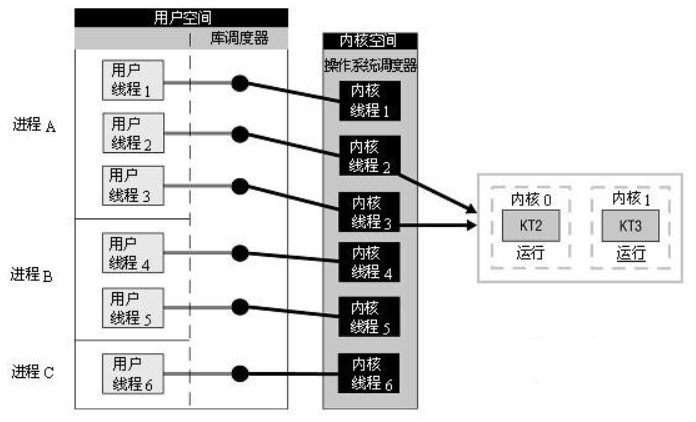
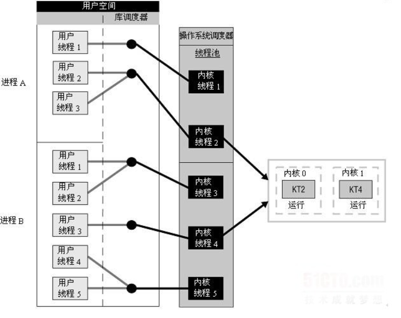
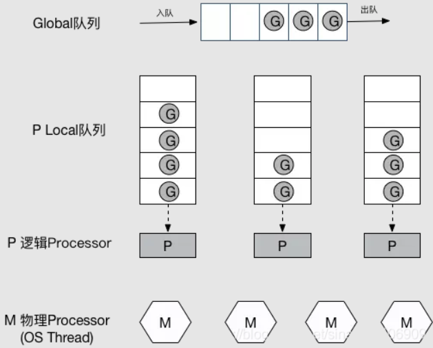

go语言是一门非常优秀的语言，go语言最大的特色就是从语言层面支持并发(Goroutine)，
调研Goroutine的底层原理，形成研究报告

截止时间：2022-04-28

<!--more-->

## 线程的分类

线程的实现可以分三类：用户级线程，内核级线程和混合式线程。

### 用户级线程

*用户级线程*是指 不需要内核支持而在用户程序中实现的线程，它的内核的切换是由用户态程序自己控制内核的切换，不需要内核的干涉。但是它不能像内核级线程一样更好的运用多核CPU。

库调度器从进程的多个线程中选择一个线程，然后该线程和该进程允许的一个内核线程关联起来。内核线程将被操作系统调度器指派到处理器内核。

用户级线程是一种 **多对一** 的线程映射。

### 内核级线程

内核级线程:切换由内核控制，当线程进行切换的时候，由用户态转化为内核态。切换完毕要从内核态返回用户态。可以很好的运用多核CPU，就像Windows电脑的四核八线程，双核四线程一样。

内核线程驻留在内核空间，它们是内核对象。有了内核线程，每个用户线程被映射或绑定到一个内核线程。用户线程在其生命期内都会绑定到该内核线程。一旦用户线程终止，两个线程都将离开系统。

这被称作**一对一**线程映射。

## goroutine

通常goroutine会被当做coroutine（**协程**）的 golang实现。
goroutine和它的Go Scheduler在底层实现上其实是属于混合型线程，goroutine并不等同于协程。

组合方式的多线程实现, 线程创建完全在用户空间中完成，线程的调度和同步也在应用程序中进行. 一个应用程序中的多个用户级线程被映射到一些（小于或等于用户级线程的数目）内核级线程上。

下图说明了用户级与内核级的组合实现方式, 在这种模型中，每个内核级线程有一个可以轮流使用的用户级线程集合

## goroutine的内存分配

每一个OS线程都有一个固定大小的内存块(一般会是2MB)来做栈，这个栈会用来存储当前正在被调用或挂起(指在调用其它函数时)的函数的内部变量。这个固定大小的栈同时很大又很小。因为2MB的栈对于一个小小的goroutine来说是很大的内存浪费，而对于一些复杂的任务（如深度嵌套的递归）来说又显得太小。因此，Go语言做了它自己的『线程』。

在Go语言中，每一个goroutine是一个独立的执行单元，相较于每个OS线程固定分配2M内存的模式，goroutine的栈采取了动态扩容方式， 初始时仅为2KB，随着任务执行按需增长，最大可达1GB，且完全由golang自己的调度器 Go Scheduler 来调度。此外，GC还会周期性地将不再使用的内存回收，收缩栈空间。

## G-P-M 模型

- G: 表示Goroutine，每个Goroutine对应一个G结构体，G存储Goroutine的运行堆栈、状态以及任务函数，可重用。G并非执行体，每个G需要绑定到P才能被调度执行。
- P: Processor，表示逻辑处理器， 对G来说，P相当于CPU核，G只有绑定到P(在P的local runq中)才能被调度。对M来说，P提供了相关的执行环境(Context)，如内存分配状态(mcache)，任务队列(G)等，**P的数量决定了系统内最大可并行的G的数量**（前提：物理CPU核数 >= P的数量），P的数量由用户设置的GOMAXPROCS决定，但是不论GOMAXPROCS设置为多大，P的数量最大为256。
- M: Machine，OS线程抽象，代表着真正执行计算的资源，在绑定有效的P后，进入schedule循环；而schedule循环的机制大致是从Global队列、P的Local队列以及wait队列中获取G，切换到G的执行栈上并执行G的函数，调用goexit做清理工作并回到M，如此反复。M并不保留G状态，这是G可以跨M调度的基础，M的数量是不定的，由Go Runtime调整，为了防止创建过多OS线程导致系统调度不过来，目前默认最大限制为10000个。

Go调度器工作时会维护两种用来保存G的任务队列：一种是一个Global任务队列，一种是每个P维护的Local任务队列。

当通过go关键字创建一个新的goroutine的时候，它会优先被放入P的本地队列。为了运行goroutine，M需要持有（绑定）一个P，接着M会启动一个OS线程，循环从P的本地队列里取出一个goroutine并执行。还有work-stealing调度算法：当M执行完了当前P的Local队列里的所有G后，P也不会什么都不干，它会先尝试从Global队列寻找G来执行，如果Global队列为空，它会随机挑选另外一个P，从它的队列里中拿走一半的G到自己的队列中执行。
