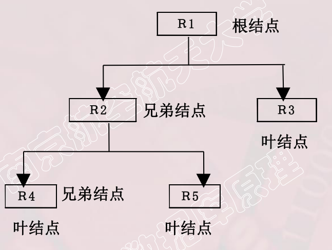

数据模型是对现实世界数据特征的抽象。（通俗地讲数据模型就是现实世界的模拟）
数据模型是数据库系统的核心和基础
数据模型应满足三方面要求：
		能比较真实地模拟现实世界 ; 容易为人所理解 ; 便于在计算机上实现. 
<!--more-->

## 两类数据模型

### 概念模型(信息模型)

按照用户的观点来对数据和信息建模，用于数据库设计。

### 逻辑模型和物理模型

- 逻辑模型主要包括：

  网状模型、层次模型、关系模型、面向对象模型、对象关系数据模型、半结构化数据模型等

  按照计算机系统的观点对数据建模，用于DBMS实现
  
- 物理模型

  是对数据最底层的抽象，描述数据在系统内部的表示方式和存取方法，在磁盘或磁带上的存储方式和存取方法。

## 概念模型

**用途**：用于信息世界的建模；现实世界到机器世界的一个中间层次；数据库设计的工具；数据库设计人员和用户之间进行交流的语言。

**基本要求**：
	较强的语义表达能力；
	简单、清晰、易于用户理解。

*信息世界中的基本概念：*

- **实体(entity)**

  客观存在并可相互区别的事物称为实体。（具体的人、事、物or抽象的概念）

- **属性(attribute)**

  实体所具有的某一特性。（一个实体可以由多个属性刻画）

- **码(key)**

  唯一标识实体的属性集称为码。

- **实体型(entity type)**

  用实体名及其属性名集合 来抽象和刻画同类实体称为实体型。

- **实体集(entity set)**

  同一类型实体的集合。

- **联系(relationship)**

  现实世界中事物内部以及事物之间的联系在信息世界中反映为实体（型）内部的联系和实体（型）之间的联系；
  
  **实体内部的联系**通常是指组成实体的各属性之间的联系
  
  **实体之间的联系**通常是指不同实体集之间的联系
  
  实体之间的联系有*一对一、一对多、多对多* 等多种类型

概念模型的一种表示方法：**实体-联系方法** ( Entity-Relationship Approach )

​		用**E-R图**来描述现实世界的概念模型（E-R方法也称为E-R模型）

## 数据模型的组成要素

- **数据结构**

  描述数据库的组成对象，以及对象之间的联系；

  数据结构是对系统静态特性的描述。

- **数据操作**

  操作即集合，包括操作及有关的操作规则；

  数据操作的类型：查询，更新（包括插、删、改）

  ***数据模型对操作的定义：***

  > 操作的确切含义
  > 操作符号
  > 操作规则（eg. 优先级）
  > 实现操作的语言
  
  *数据操作使对系统动态特性的描述*

- **数据的完整性约束条件**

  **完整性规则**给定的数据模型中数据及其联系所具有的制约和依存规则。
  
  用以限定符合数据模型的数据库状态以及状态的变化，以保证数据的正确、有效和相容。
  
  ***数据模型对完整性约束条件的定义***
  
  > 反映和规定必须遵守的基本的通用的完整性约束条件。
  >
  > 提供完整性约束条件的机制，以反映具体应用所涉及的数据必须遵守的特定的语义约束条件。

## 常用的数据模型

- 层次模型

- 网状模型

- 关系模型

- 面向对象数据模型

- 对象关系数据模型

- 半结构化数据模型

**格式化模型**

​	层次模型和网状模型统称为 **格式化模型**

​	格式化模型中数据结构的单位是 **基本层次联系**

​		**基本层次联系**是指两个记录以及它们之间的一对多的联系

## 层次模型

 层次模型用 **树状结构**来表示各类实体以及实体间的联系。

满足下面两个条件的基本层次联系的集合为层次模型：

1. 有且只有一个结点没有双亲结点-根结点
2. 根以外的其它结点有且只有一个双亲结点

层次模型的**特点**：

> 结点的双亲是唯一的
> 只能直接处理一对多的实体联系
> 每个记录类型可以定义一个排序字段，称为码字段
> 任何记录值只有按其路径查看时，才能显出它的全部意义
> 没有一个子女记录值能够脱离双亲记录而独立存在

层次模型的**数据操纵**：

> 查询、插入、删除、更新

层次模型的**完整性约束条件**

> 无相应的双亲结点值就不能插入子女结点值
>
> 如果删除双亲结点值，则相应的子女结点值也被同时删除
>
> 更新操作时，应更新所有相应记录，以保证数据的一致性

层次模型的**优缺点**：
		*优点*

> 数据结构简单清晰
>
> 查询效率高，性能优于关系模型，不低于网状模型
>
> 提供了良好的完整性支持

​		*缺点*

> 结点之间的多对多联系表示不自然
>
> 插入和删除操作的限制多，应用程序的编写复杂
>
> 查询子女结点必须通过双亲结点
>
> 层次命令趋于程序化

## 网状模型

满足下面两个条件的基本层次联系的集合：

1. 允许一个以上的结点无双亲
2. 一个结点可以有多于一个的双亲

网状模型与层次模型的区别：

> 网状模型允许多个结点没有双亲结点
>
> 网状模型允许结点有多个双亲结点
>
> 网状模型允许两个结点之间有多种联系（复合联系）
>
> 网状模型可以更直接地描述现实世界
>
> 层次模型是网状模型的一个特例

网状模型的操纵与完整性约束：

> 码：唯一表示记录的数据项的集合
>
> 一个联系中双亲记录与子女记录之间是一对多联系
>
> 支持双亲记录和子女记录之间某些约束条件

网状模型的优缺点：

​		*优点：*

> 能够更为直接地描述现实世界，如一个结点可以有多个双亲
>
> 具有良好的性能，存取效率较高

​		*缺点：*

> 结构较为复杂。且随着应用环境的扩大，数据库的结构更加复杂，不利于最终用户掌握
>
> DDL、DML语言复杂，用户不容易使用
>
> 记录之间联系是通过存取路径实现的，用户必须了解系统结构的细节

## 关系模型

关系模型的数据结构：

- 关系（relation）

  一个关系对应通常说的一张表

- 元组（tuple）

  表中的一行即为一个元组

- 属性（attribute）

  表中的一列即为属性，给每个属性起一个名称即属性名

- 主码（码键）

  表中的某个属性组，可以唯一确定一个元组
  
- 域（domain）

  是一组具有相同数据类型的值的集合。属性的取值范围来自某个域

- 分量

  元组中的一个属性值

- 关系模式

  对关系的描述

关系必须是规范化的，满足一定的规范条件
		最基本的规范条件：关系的每一个分量必须是一个不可分的数据项，不允许表		中还有表。

关系模型的操纵：
		数据操作是集合操作，操作对象和操作结果都是关系
		`查询`  `插入`  `删除`  `更新`  

关系的完整性约束条件：

- 实体完整性
- 参照完整性
- 用户定义的完整性

关系模型的优缺点：

​		*优点：*

> 建立在严格的数学概念的基础上
>
> 概念单一
> 		实体和各类联系都用关系来表示
> 		对数据的检索结果也是关系
>
> 关系模型的存取路径对用户透明
> 		具有更高的数据独立性，更好的安全保密性
> 		简化了程序员的工作和数据库开发建立的工作

​		*缺点：*

> 存取路径对用户透明，查询效率不如格式化数据模型
>
> 为提高性能，必须对用户的查询请求进行优化，增加了开发数据库管理系统的难度

